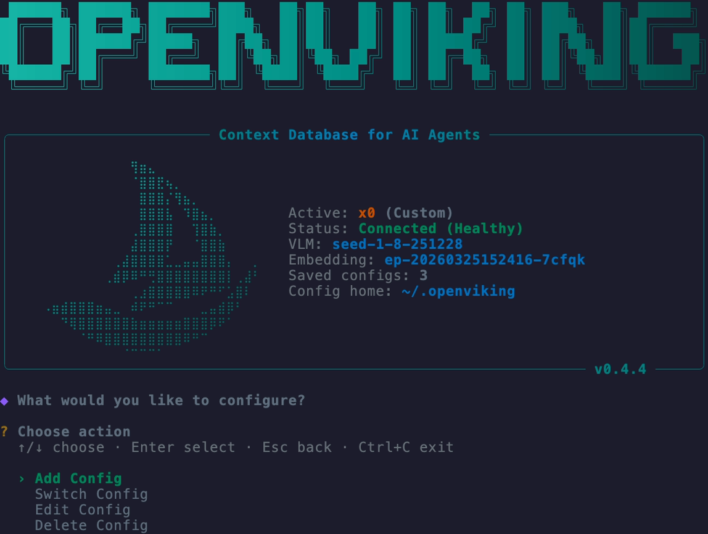
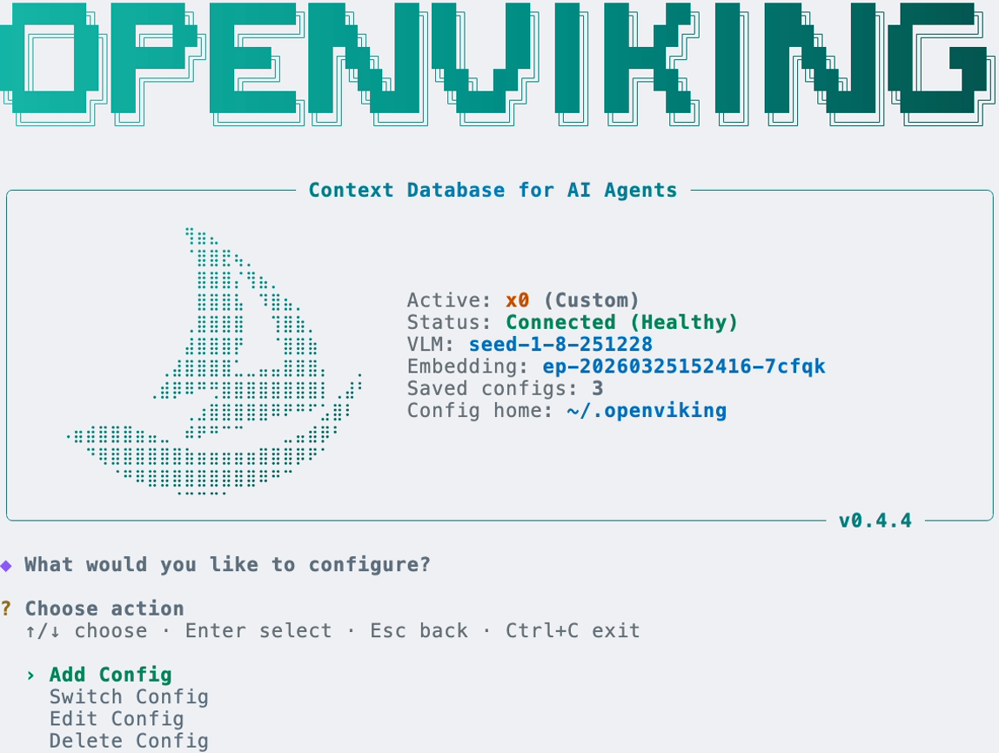
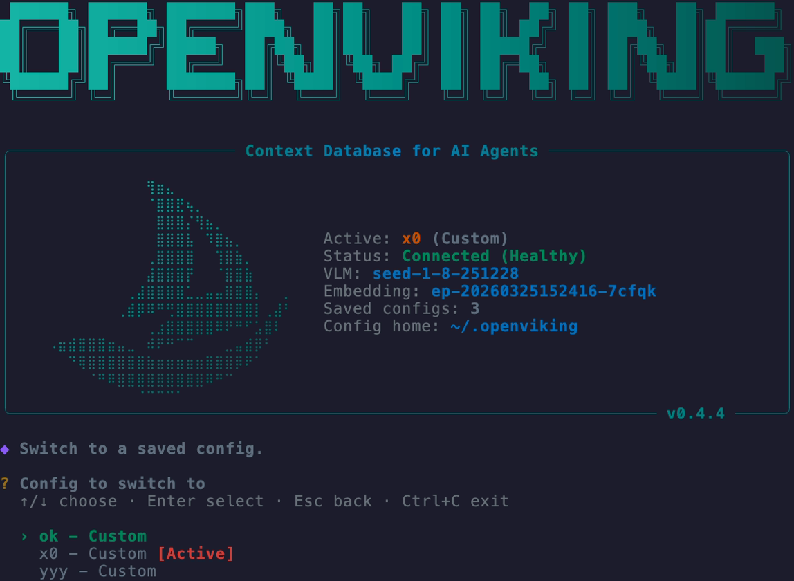
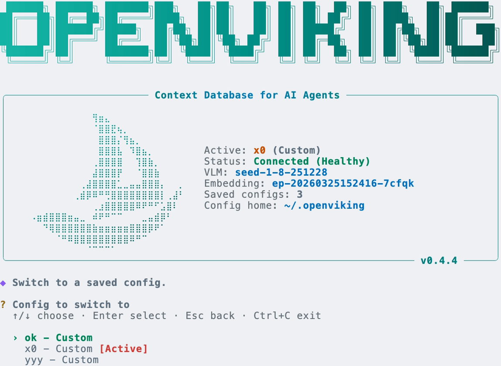

# termclip

> Faithful PNG screenshots of an interactive terminal / TUI — in **both dark and light themes**.

`termclip` drives a **persistent `tmux` session** so you (or an AI agent) can launch a
command, type text, send keys, and **snapshot the rendered screen on demand**. Each
snapshot is replayed through [VHS](https://github.com/charmbracelet/vhs) under a *real*
terminal theme, so colors, bold/italic/underline, 256‑color, truecolor, and box‑drawing
are reproduced exactly — and the **same screen** is rendered under a dark *and* a light
palette (default foreground/background and the 16 ANSI colors flip correctly per theme).

<table>
  <tr>
    <td align="center"><b>Dark</b></td>
    <td align="center"><b>Light</b></td>
  </tr>
  <tr>
    <td></td>
    <td></td>
  </tr>
</table>

<sub>The same `ov config` TUI screen, captured once and rendered in both themes. Note the
truecolor wordmark stays constant while the default text and 16‑color palette flip per theme.</sub>

## Why

An AI agent working in a loop often needs to **see** what a terminal program looks like —
not just its text, but the *rendered* screen: highlighted menu rows, colored status, tables,
selection state. Plain `tmux capture-pane` gives text; static ANSI→image converters use a
fixed palette and can't produce a faithful **light** theme (default‑fg text goes invisible).

termclip solves both: it keeps an **interactive, persistent terminal** you can drive
step‑by‑step, and renders each snapshot through a real themed terminal so **dark and light
are both faithful**. Capture, look, type more, capture again.

## Install

Runtime deps: **`tmux`** ≥ 3.2 and **`vhs`** (required); **ImageMagick** (`magick`/`convert`,
optional — trims the image to content). On macOS: `brew install tmux vhs imagemagick`.

### As an agent skill (recommended)

This repo ships the skill at [`skills/termclip/`](skills/termclip), installable with
[`npx skills`](https://github.com/vercel-labs/skills) — works for Claude Code, Codex,
Cursor, OpenCode and more:

```bash
npx skills add ZaynJarvis/termclip --agent claude-code -g   # global: ~/.claude/skills/
# drop -g to install into ./.claude/skills/ for the current project
```

### As a CLI

```bash
git clone https://github.com/ZaynJarvis/termclip.git
cd termclip
./install.sh            # installs deps if missing, links `termclip` onto your PATH
# …or just run it in place:
./skills/termclip/bin/termclip help
```

## Quickstart

### One‑shot — capture a command's opening screen
```bash
termclip shot --out hero --cols 100 --rows 40 --settle 3000 -- ov config
#   -> hero.dark.png   hero.light.png
```
For non-interactive command output, `shot` captures the temporary session's scrollback
and grows the render to fit the captured ANSI grid. `--cols` still controls wrapping.

### Live — drive the program and snapshot any screen
```bash
termclip start -s demo --cols 100 --rows 40 -- ov config   # launch in a persistent session
termclip snap  -s demo menu --settle 3000                  # snapshot the current screen
termclip key   -s demo Down Enter                          # navigate (arrow keys, Enter)
termclip snap  -s demo switch                              # snapshot the new screen
termclip key   -s demo Escape                              # back out safely
termclip stop  -s demo                                     # always stop when done
```

Every `snap`/`shot` prints the PNG paths it wrote — open them, or (for an agent) read them.

<table>
  <tr>
    <td></td>
    <td></td>
  </tr>
</table>

<sub>A different screen reached by sending <code>Down Enter</code> to the live session — the
<code>[Active]</code> tag and highlighted selection are preserved in both themes.</sub>

## Command reference

| Command | Description |
|---|---|
| `start -s NAME [--cols N] [--rows N] -- <cmd...>` | Launch `<cmd>` in a persistent, fixed‑size session |
| `type -s NAME "<text>"` | Type literal text into the session (no Enter) |
| `key -s NAME <Key>...` | Send keys (`Enter Up Down Left Right Escape Tab Space C-c BSpace F1`…) |
| `snap -s NAME [PREFIX] [--theme dark\|light\|both] [--settle MS]` | Snapshot the current screen → PNG(s) |
| `shot --out PREFIX [--cols N --rows N --settle MS] -- <cmd...>` | `start → settle → capture scrollback → render both → stop`, in one call |
| `render <file.ans> [--out PREFIX] [--theme ...] [--cols N --rows N]` | Render a raw `tmux capture-pane -e` dump to PNG(s) |
| `ls` | List active sessions |
| `stop -s NAME` · `stop --all` | Kill a session / kill everything and clean state |
| `help` | Show usage |

### Key options
- **`--settle MS`** — wait before capturing, so a slow/animated TUI finishes drawing
  (use ~3000ms for a program's first screen if it probes a server).
- **`--cols` / `--rows`** — terminal geometry. Tall TUIs need more rows; the capture shows
  exactly what a terminal that size would show.
- **`--theme dark|light|both`** — which theme(s) to render (default `both`).
- **`-s NAME`** — session name (default `main`). Sessions share one tmux server, so use
  distinct names for concurrent captures; `stop --all` kills every termclip session.

## Themes

Defaults: `Catppuccin Mocha` (dark) and `Catppuccin Latte` (light). Override with any
theme from `vhs themes`:

```bash
TERMCLIP_DARK_THEME="Dracula" TERMCLIP_LIGHT_THEME="Github" \
  termclip shot --out demo -- some-tui
```

## How it works

```
 tmux (-L termclip)            per snapshot
 ┌────────────────┐     capture-pane -p -e          VHS replay (dark theme)  ─► PREFIX.dark.png
 │ your program,  │ ──►  one ANSI grid        ──►    VHS replay (light theme) ─► PREFIX.light.png
 │ driven by keys │                                  then  magick -trim
 └────────────────┘
```

A detached tmux session (on its own socket, so it never touches your tmux) holds the live
program. Live `snap` grabs the visible grid *with* ANSI escapes; one-shot `shot` grabs the
temporary session scrollback so long command output is not lost. The renderer sizes the
VHS canvas from the captured ANSI grid, replays it inside a headless terminal under a real
theme, and screenshots it. Because VHS applies a full palette, both the **default fg/bg
flip** and the **16‑color remap** happen per theme, while truecolor stays absolute. Full
internals, env vars, and troubleshooting in
[`skills/termclip/reference.md`](skills/termclip/reference.md).

## Use as a Claude Code / AI agent skill

The skill lives at [`skills/termclip/`](skills/termclip) — a [Claude Code skill](https://docs.claude.com/en/docs/claude-code/skills)
(`SKILL.md` + bundled `bin/termclip` + `reference.md`). `npx skills` installs just that
directory (the README/examples stay here in the repo). Install it so an agent can take
terminal screenshots inside its loop:

```bash
npx skills add ZaynJarvis/termclip --agent claude-code -g
# or, from a clone:  cp -R skills/termclip ~/.claude/skills/termclip
```

The agent then captures a screen, **reads the PNG to see it**, sends more keys, and captures
again — closing the loop between "type something" and "see how the terminal looks".

## Requirements

- `tmux` ≥ 3.2 (truecolor / `terminal-features`)
- `vhs` (pulls in `ttyd` + `ffmpeg`)
- `imagemagick` *(optional, for trimming)*
- `bash`, `perl` *(present by default on macOS/Linux)*

## License

MIT — see [LICENSE](LICENSE).
